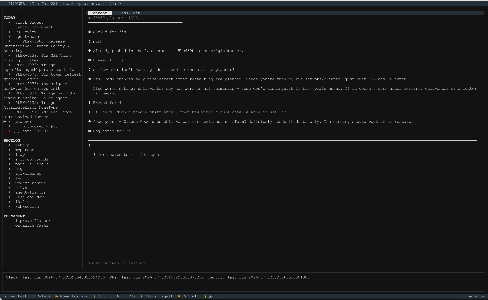

# Planner

Persistent terminal dashboard for daily/weekly planning and Claude Code session monitoring.



## Install

> **For Claude/LLMs:** Run these steps exactly in order. All commands assume macOS with `uv` installed.

```bash
# 1. Clone — install wherever you like; default is ~/planner
PLANNER_INSTALL_DIR="${PLANNER_INSTALL_DIR:-$HOME/planner}"
git clone git@github.com:twall/planner.git "$PLANNER_INSTALL_DIR"

# 2. Create venv and install
cd "$PLANNER_INSTALL_DIR"
uv venv --python 3.11 .venv
uv pip install -r requirements.txt
uv pip install -e .

# 3. Make launcher executable
chmod +x "$PLANNER_INSTALL_DIR/scripts/planner"

# 4. (Optional) symlink launcher to PATH
ln -sf "$PLANNER_INSTALL_DIR/scripts/planner" ~/.local/bin/planner
```

Set credentials before running:
```bash
export JIRA_API_TOKEN=<your jira token>          # Atlassian API token
export JIRA_CLOUD_ID=<your atlassian cloud id>   # From your Atlassian URL
export SENTRY_ACCESS_TOKEN=<your sentry token>
# Optional
export PLANNER_INSTALL_DIR=<path>                # Defaults to ~/planner
export PLANNER_SESSION_BACKEND=tmux              # Default: screen
```

Configure integrations in `settings.json`:
```json
{
  "jira_projects": ["MYPROJECT"],
  "sentry_projects": ["my-app", "my-api"],
  "git_repos": ["org/repo1", "org/repo2"],
  "slack_channels": ["#alerts", "#engineering"]
}
```

On first launch, planner automatically installs Claude Code skills (`/planner`, `/planner-task`, `/planner-add`) as symlinks in `~/.claude/commands/`.

## Run

```bash
~/planner/scripts/planner
# or if symlinked:
planner
```

## Claude Code Skills

Once planner has run once, these skills are available in any Claude Code session:

| Skill | Description |
|-------|-------------|
| `/planner` | Launch the planner TUI |
| `/planner-task add "title" [--today\|--week\|--backlog]` | Add a task directly to the DB |
| `/planner-task list` | List current tasks |
| `/task` | Alias for `/planner-task` |
| `/planner-add "title" [--desc "..."] [--today\|--week\|--backlog]` | Queue task(s) for inbox (picked up on next planner launch) |

### Adding tasks from a Claude session

If Claude produces a list of action items, say **"make planner tasks for these"** and Claude will use `/planner-add` to queue them. They appear in the planner the next time it starts (or after detaching from a session).

## Keybindings

| Key | Action |
|-----|--------|
| ↑ / ↓ / J / K | Move task cursor |
| enter | Attach to screen session (content pane) / edit task (task pane) |
| ← / → | Switch between content and task panes |
| p | Preview session output (fullscreen) |
| n | New task |
| d | Delete task (and kill session if any) |
| m | Move task horizon (today → this week) |
| ctrl+s | Start Claude session for task |
| j | Sync JIRA |
| b | Re-run PR review |
| s | Re-run Slack digest |
| R | Re-run all recurring tasks |
| h / ? | Show keybinding help |
| q | Quit |

## Data

- Tasks DB: `~/planner/data/tasks.db`
- Inbox (Claude-queued tasks): `~/.planner/inbox.json` (consumed on startup)
- Settings: `~/planner/settings.json`
- Recurring tasks config: `~/planner/tasks.json`
